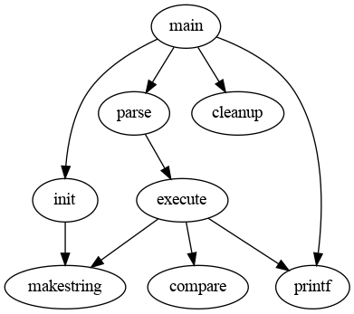

# A repo of random but scientific notes

* The example of scientific writting
* The example of some programming language(C,Bash,dot,etc.)
* The intuitive introduction/ explanation of deep learning models

## Programming language 
### [dot](https://www.graphviz.org/pdf/dotguide.pdf)
> in a \*.dot text file : (figs/example.dot)
~~~dot
strict diagraph G {
	main -> parse -> execute;
	main -> init;
	main -> cleanup;
	execute -> makestring;
	execute -> printf;
	execute -> compare;
	init -> makestring;
	main -> printf;
}
~~~
> then execute `dot -Tpng example.dot -o example.png` to make and export `PNG` format of dot graph

